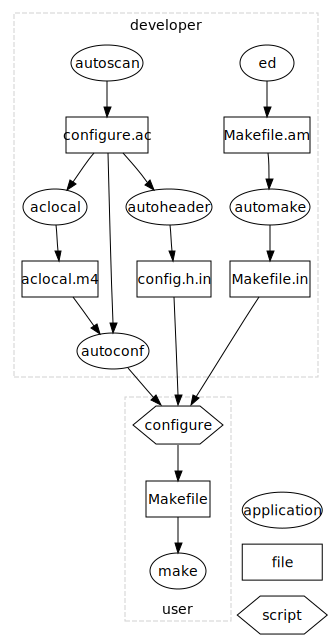

====================
 Autotools 实例分析
====================

简介
~~~~

autotools 的主要目的是方便用户，简化软件编译的步骤。用 autotools 搭建的软件都可
以这样来编译::

    ./configure
    make
    make install

用户不需要去自己检查系统配置，软件的依赖，安装路径。这三步已经成为 Linux (以及
其他 UNIX 系统) 上编译软件的标准命令，其他编译系统 (比如 cmake, scons, python
的 setup.py) 尽管有各自的好处，但反而不容易被用户接受。

下面以 xwininfo 为例，分析一下 autotools 的使用。xwininfo 是一个很简单的软件，
只为用户提供两个文件::

    $ conary q xwininfo --ls
    /usr/share/man/man1/xwininfo.1.gz
    /usr/bin/xwininfo

在 /usr/bin 目录下安装了一个可执行程序，然后在 /usr/share 目录下安装了一个手册。

xwininfo 的源代码树
~~~~~~~~~~~~~~~~~~~

下边看一下 xwininfo 的源代码。

编译完成之后的目录树::

    build/xwininfo-1.1.1/xwininfo-1.1.1/
    |-- COPYING
    |-- ChangeLog
    |-- INSTALL
    |-- Makefile
    |-- Makefile.am
    |-- Makefile.in
    |-- README
    |-- aclocal.m4
    |-- autogen.sh
    |-- autom4te.cache
    |   |-- output.0
    |   |-- output.1
    |   |-- output.2
    |   |-- requests
    |   |-- traces.0
    |   |-- traces.1
    |   `-- traces.2
    |-- clientwin.c
    |-- clientwin.h
    |-- clientwin.o
    |-- config.guess
    |-- config.h
    |-- config.h.in
    |-- config.h.in~
    |-- config.log
    |-- config.status
    |-- config.sub
    |-- configure
    |-- configure.ac
    |-- depcomp
    |-- dsimple.c
    |-- dsimple.h
    |-- dsimple.o
    |-- install-sh
    |-- m4
    |-- missing
    |-- stamp-h1
    |-- strnlen.c
    |-- strnlen.h
    |-- strnlen.o
    |-- xwininfo
    |-- xwininfo.1
    |-- xwininfo.c
    |-- xwininfo.man
    `-- xwininfo.o

    2 directories, 43 files

一共有 2 个目录 (其中 m4 是一个空目录)，43 个文件。

再看从 tar 包 (layers/wrll-userspace/graphics/packages/xwininfo-1.1.1.tar.bz2)
解压出来的目录树::

    .
    |-- COPYING
    |-- ChangeLog
    |-- INSTALL
    |-- Makefile.am
    |-- Makefile.in
    |-- README
    |-- aclocal.m4
    |-- autogen.sh
    |-- clientwin.c
    |-- clientwin.h
    |-- config.guess
    |-- config.h.in
    |-- config.sub
    |-- configure
    |-- configure.ac
    |-- depcomp
    |-- dsimple.c
    |-- dsimple.h
    |-- install-sh
    |-- missing
    |-- strnlen.c
    |-- strnlen.h
    |-- xwininfo.c
    `-- xwininfo.man

    0 directories, 24 files

只有 24 个文件。

再看 `git 仓库`_ 中的目录树 (也就是开发者进行开发的目录树)::

    .
    |-- autogen.sh
    |-- clientwin.c
    |-- clientwin.h
    |-- configure.ac
    |-- COPYING
    |-- dsimple.c
    |-- dsimple.h
    |-- Makefile.am
    |-- README
    |-- strnlen.c
    |-- strnlen.h
    |-- xwininfo.c
    `-- xwininfo.man

    0 directories, 13 files

.. _git 仓库: http://cgit.freedesktop.org/xorg/app/xwininfo/

只有 13 个文件。显然，tar 包里包含一些生成的文件，而在用户执行 ./configure 和
make 的时候，又生成了一些文件。

xwininfo 的编译系统
~~~~~~~~~~~~~~~~~~~

我们可以把 git 仓库中的 13 个文件分一下类。

代码文件
    clientwin.c  clientwin.h  dsimple.c  dsimple.h  strnlen.c  strnlen.h
    xwininfo.c
文档
    COPYING  README  xwininfo.man
编译系统
    autogen.sh  configure.ac  Makefile.am

代码和文档可算作一个项目真正“有意义”的东西，除此之外的其他文件只有三个。它们也
就是 xwininfo 的编译系统。

什么是 autotools?
~~~~~~~~~~~~~~~~~

autotools 指的是:

- autoconf - 生成 configure 文件 (configure.ac -> configure)
- automake - 生成 Makefile 模板 (Makefile.am -> Makefile.in) (XXX)
- libtool - 生成共享库

上图解释了一个软件，从 git 仓库到安装到用户系统上的过程。过程的参与者有两个，开
发者和用户。

autotools (autoconf 和 automake) 是给开发者用的，用户在编译软件时，不需要安装
autotools。用户要执行的命令是：

configure
    由 autoconf 生成
make
    在用户系统上安装。Makefile 是由 configure 从 Makefile.in 生成的。

autoconf
~~~~~~~~

automake
~~~~~~~~

