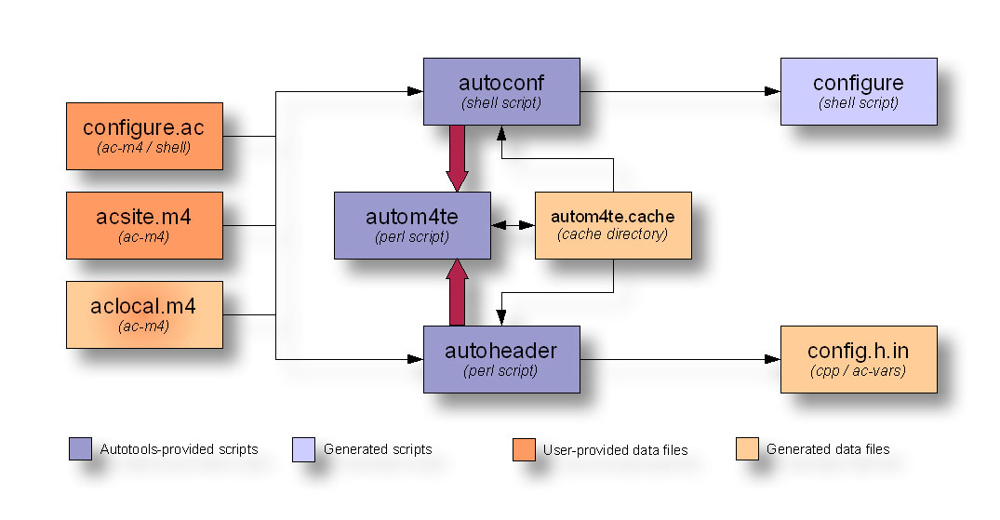
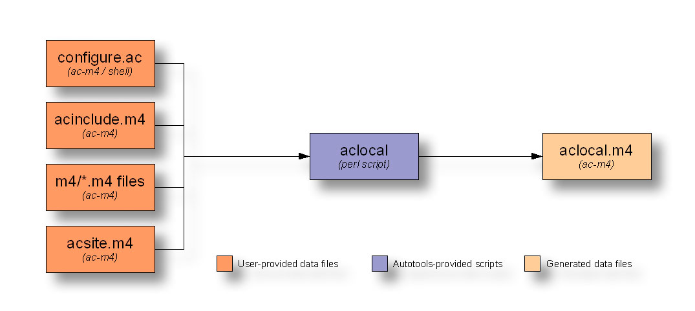
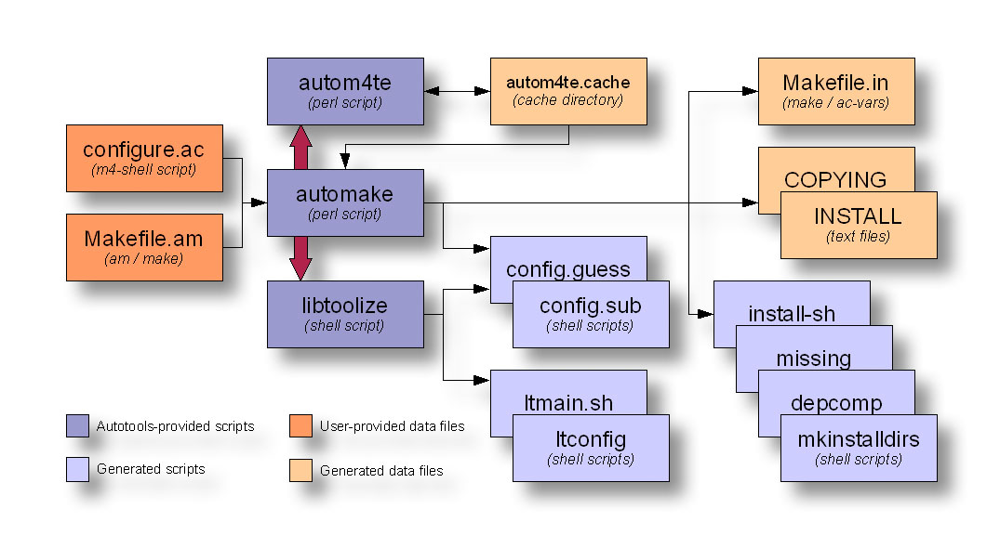
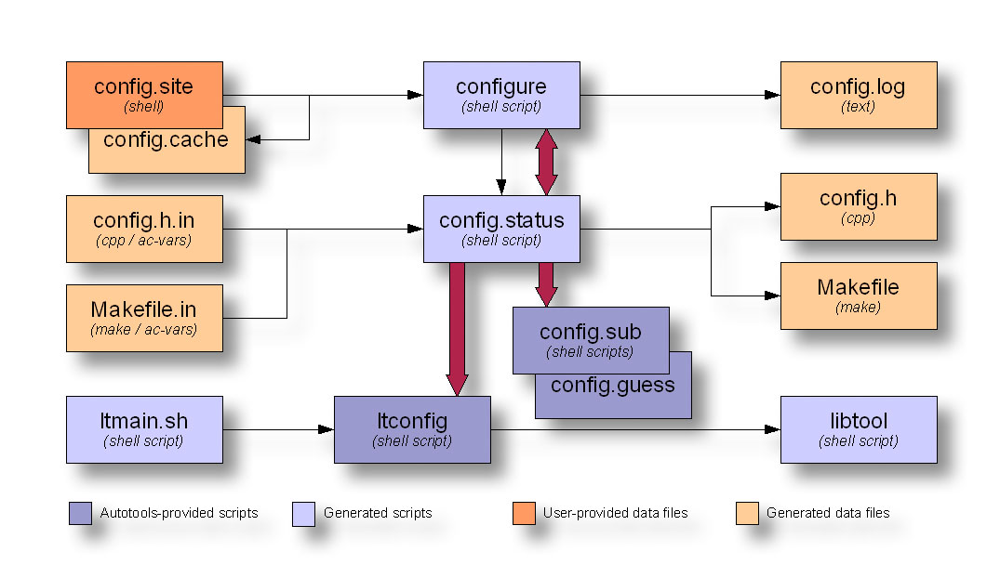
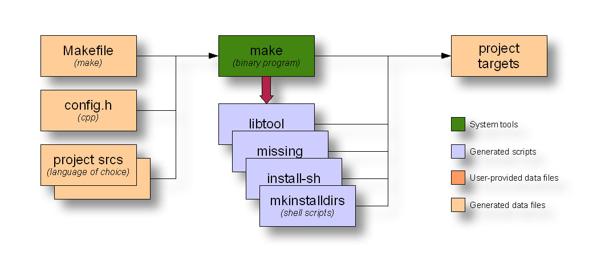

====================
 Autotools 实例分析
====================

.. contents:: 目录

简介
~~~~

autotools 的主要目的是方便用户, 简化软件编译的步骤。用 autotools 搭建的软件都可
以这样来编译::

    $ ./configure
    $ make
    $ sudo make install

用户不需要去自己检查系统配置, 软件的依赖, 安装路径。这三步已经成为 Linux (以及
其他 UNIX 系统) 上编译软件的标准命令, 其他编译系统 (比如 cmake, scons, python
的 setup.py) 尽管有各自的好处, 但反而不容易被用户接受。

下面以 xwininfo 为例, 分析一下 autotools 的使用。xwininfo 是一个很简单的软件,
只为用户提供两个文件::

    $ conary q xwininfo --ls
    /usr/share/man/man1/xwininfo.1.gz
    /usr/bin/xwininfo

在 /usr/bin 目录下安装了一个可执行程序, 然后在 /usr/share 目录下安装了一个手册。

xwininfo 的源代码树
~~~~~~~~~~~~~~~~~~~

下边看一下 xwininfo 的源代码。

编译完成之后的目录树::

    build/xwininfo-1.1.1/xwininfo-1.1.1/
    |-- COPYING
    |-- ChangeLog
    |-- INSTALL
    |-- Makefile
    |-- Makefile.am
    |-- Makefile.in
    |-- README
    |-- aclocal.m4
    |-- autogen.sh
    |-- autom4te.cache
    |   |-- output.0
    |   |-- output.1
    |   |-- output.2
    |   |-- requests
    |   |-- traces.0
    |   |-- traces.1
    |   `-- traces.2
    |-- clientwin.c
    |-- clientwin.h
    |-- clientwin.o
    |-- config.guess
    |-- config.h
    |-- config.h.in
    |-- config.h.in~
    |-- config.log
    |-- config.status
    |-- config.sub
    |-- configure
    |-- configure.ac
    |-- depcomp
    |-- dsimple.c
    |-- dsimple.h
    |-- dsimple.o
    |-- install-sh
    |-- m4
    |-- missing
    |-- stamp-h1
    |-- strnlen.c
    |-- strnlen.h
    |-- strnlen.o
    |-- xwininfo
    |-- xwininfo.1
    |-- xwininfo.c
    |-- xwininfo.man
    `-- xwininfo.o

    2 directories, 43 files

一共有 2 个目录 (其中 m4 是一个空目录), 43 个文件。

再看从 tar 包 (layers/wrll-userspace/graphics/packages/xwininfo-1.1.1.tar.bz2)
解压出来的目录树::

    .
    |-- COPYING
    |-- ChangeLog
    |-- INSTALL
    |-- Makefile.am
    |-- Makefile.in
    |-- README
    |-- aclocal.m4
    |-- autogen.sh
    |-- clientwin.c
    |-- clientwin.h
    |-- config.guess
    |-- config.h.in
    |-- config.sub
    |-- configure
    |-- configure.ac
    |-- depcomp
    |-- dsimple.c
    |-- dsimple.h
    |-- install-sh
    |-- missing
    |-- strnlen.c
    |-- strnlen.h
    |-- xwininfo.c
    `-- xwininfo.man

    0 directories, 24 files

只有 24 个文件。

再看 `git 仓库`_ 中的目录树 (也就是开发者进行开发的目录树)::

    .
    |-- autogen.sh
    |-- clientwin.c
    |-- clientwin.h
    |-- configure.ac
    |-- COPYING
    |-- dsimple.c
    |-- dsimple.h
    |-- Makefile.am
    |-- README
    |-- strnlen.c
    |-- strnlen.h
    |-- xwininfo.c
    `-- xwininfo.man

    0 directories, 13 files

.. _git 仓库: http://cgit.freedesktop.org/xorg/app/xwininfo/

只有 13 个文件。显然, tar 包里包含一些生成的文件, 而在用户执行 ./configure 和
make 的时候, 又生成了一些文件。

xwininfo 的编译系统
~~~~~~~~~~~~~~~~~~~

我们可以把 git 仓库中的 13 个文件分一下类。

代码文件
    clientwin.c  clientwin.h  dsimple.c  dsimple.h  strnlen.c  strnlen.h
    xwininfo.c
文档
    COPYING  README  xwininfo.man
编译系统
    autogen.sh  configure.ac  Makefile.am

代码和文档可算作一个项目真正“有意义”的东西, 除此之外的其他文件只有三个,
autogen.sh, configure.ac 和 Makefile.am。它们也就是 xwininfo 的编译系统。

什么是 Autotools?
~~~~~~~~~~~~~~~~~

Autotools 指的是:

- Autoconf - 生成 configure 文件 (configure.ac -> configure)
- Automake - 生成 Makefile 模板 (Makefile.am -> Makefile.in) (XXX)
- Libtool - 生成共享库

.. figure:: images/autoconf.svg

    autoconf 和 automake

上图解释了一个软件从 git 仓库到安装到用户系统上的过程。过程的参与者有两个, 开发
者和用户。

Autotools (autoconf 和 automake) 是给开发者用的, 用户在编译软件时, 不需要安装
autotools。用户要执行的命令是：

configure
    由 autoconf 生成
make
    在用户系统上安装。Makefile 是由 configure 从 Makefile.in 生成的。

Autoconf
========

Autoconf 是 autotools 套件中被最早开发出来的 (1991 年)。它解决的问题包括：

- 找到系统上的库和头文件
- 软件编好后安到合适的路径
- 正确选择软件的组件和功能点

当然, 这些都是 configure 脚本的功能。而 autoconf 的作用是生成这个 configure 脚
本。

Autoconf 提供的可执行程序包括：

1. autoconf
#. autom4te
#. autoreconf
#. autoheader
#. autoscan

    autoconf 和 autoheader 的数据流图

autoconf
--------

autoconf 是一个简单的 .sh 脚本。主要功能是检查当前 shell 能否支持 M4 的处理。然
后在对命令行参数进行简单解析后, 转给 autom4te::

    $ tail -n6 /usr/bin/autoconf
    # Run autom4te with expansion.
    eval set x "$autom4te_options" \
      --language=autoconf --output=\"\$outfile\" "$traces" \"\$infile\"
    shift
    $verbose && $as_echo "$as_me: running $AUTOM4TE $*" >&2
    exec "$AUTOM4TE" "$@"

autom4te
--------

autom4te 是对 m4 的一个封装, 它能够利用缓存来提高速度。我们经常能看到这样一个缓
存目录::

    $ ls autom4te.cache/
    output.0  output.1  output.2  requests  traces.0  traces.1  traces.2

从 configure.ac 到 configure 的转换, 本质上是由 m4 完成的。这个转换过程无非就是
m4 宏定义的递归扩展。

autoreconf
----------

autoreconf 可以看作是所有 autotools 的封装, 它能够根据 configure.ac 正确调
用其他的工具, 最终生成 configure 脚本。

autoheader
----------

autoheader 能够根据 configure.ac 生成一个头文件的模板, 一般叫做 config.h.in 。
里边一般包换对项目组件和各种特性的开关(也就是宏定义)::

    $ head config.h.in
    /* config.h.in.  Generated from configure.ac by autoheader.  */

    /* Define to 1 if you have the iconv() function */
    #undef HAVE_ICONV

    /* Define to 1 if you have the <inttypes.h> header file. */
    #undef HAVE_INTTYPES_H

    /* Define to 1 if you have the <memory.h> header file. */
    #undef HAVE_MEMORY_H

用户执行 configure 后, 会从 config.h.in 生成 config.h, 其中的宏定义根据用户系统
的实际情况被替换为了真实数值::

    $ head config.h
    /* config.h.  Generated from config.h.in by configure.  */
    /* config.h.in.  Generated from configure.ac by autoheader.  */

    /* Define to 1 if you have the iconv() function */
    #define HAVE_ICONV 1

    /* Define to 1 if you have the <inttypes.h> header file. */
    #define HAVE_INTTYPES_H 1

    /* Define to 1 if you have the <memory.h> header file. */

对于 autotools, 模板文件都以 .in 做为后缀, 比如 config.h.in, Makefile.in。模板
文件由 configure 处理成最终文件.

autoscan
--------
autoscan 能够扫描项目源代码, 自动生成 configure.ac。

Automake
========

在 automake 出现之前, 人们必须手写 Makefile。但是项目稍微有点规模后, Makefile
就很容易变得又长又臭, 很难维护。但是有这样一个事实, 大多数项目在结构上都是类似
的。无论项目的代码文件里有什么, 都是在一个递归的代码树里面, 并且一般都要支持这
些常见的 make 操作::

    $ make
    $ make clean
    $ make check
    $ make dist
    ....

Automake 能够简化 Makefile 的维护, 自动生成可移植的 Makefile。

Automake 提供两个可执行程序:

1. automake
#. aclocal

automake
--------

automake 能够从抽象的高层描述 (Makefile.am) 生成具体的 makefile 模板 (Makefile.in)::

    $ wc Makefile*
       60   266  1901 Makefile.am
      763  3087 25552 Makefile.in
      763  3207 28080 Makefile

可以看到 Makefile.am 很短。而自动生成的 Makefile.in 和 Makefile 行数相同, 但是
由于有宏扩展, Makefile 更大。

从语法上讲, Makefile.am 也是标准的 makefile。

aclocal
-------

automake 实际是对 autoconf 的一个扩展, 也就是提供一系列 m4 宏定义给用户使用。用
户可以在 configure.ac 里调用这些宏。但是 autoconf 最初的设计并没有考虑到这么大
程度的扩展。

autoconf 最初提供的扩展机制是通过一个叫 aclocal.m4 的文件。用户可以在里边添加自
定义的宏, autoconf 在处理 configure.ac 的时候会自动读取这个文件里的宏定义。

显然, 如果要使用 automake, 用户必须创建一个 aclocal.m4, 然后通过 m4_include 把
automake 的宏都包含进来。这样 autoconf 就能识别出 configure.ac 里边的 automake
宏了。

这个办法不算友好, 因为它把 M4 的一些概念暴露出来了, 而 autoconf 本身是要把 M4
封装起来的, 不想让用户直接接触 M4。

所以开发者设计了 aclocal 来解决这个问题。它能够自动生成 aclocal.m4 文件, 供
autoconf 使用。

    aclocal 的数据流图

Libtool
=======

Libtool 的目的是简化共享库的开发。尽管各种 UNIX 系统是基本相似的, 但是它们在共
享库的处理上有着各种各样的差别。libtool 可以帮开发者避开这些陷阱。比如:

- 库的命名。libname.so, libname.a, libname.sl。有的系统什么不支持共享库。
- 库的动态加载。有的系统提供 libdl.so (dlopen), 有的系统提供其他的机制, 有的系
  统不支持动态加载。

Libtool 包提供了这些程序以及头文件和库:

- libtool 一个 shell 脚本
- libtoolize 能够为工程生成特定的 libtool 脚本。这个脚本会在用户系统上, 由 make
  执行。
- libdl 一个通用的共享库加载接口。
- ltdl.h 头文件

    automake 和 libtool 数据流图

Automake 和 Libtool 都是对 autoconf 的扩展, 用几个简单的宏调用就能够使能
automake 和 libtool。

软件的编译过程
~~~~~~~~~~~~~~

以上的内容都是从开发者的角度看的。下面分析一下在用户系统上发生的事情。

执行 ./configure
================

用户拿到了一个 tarball。里边有这些东西:

- 源代码 (.c, .h)
- 一个 configure 脚本
- 一些模板文件, 包括 Makefile.in, config.h.in 等等。其他例子有 glib.pc.in,
  trashapplet-empty-progress.ui.in。

用户需要进行的操作很简单, 就是一条命令: ::

    ./configure --prefix=/usr --enable-foo=yes --enable-bar=no...

    configure 过程数据流图

1. configure 脚本会收集系统信息, 以及用户给的命令行选项。
#. configure 最终生成 config.status 脚本, 并且执行这个脚本。
#. config.status 把模板文件都处理为最终的文件。
#. 日志记录到 config.log 文件里。

执行 make
=========

Makefile 已经由 configure 生成, 用户只需要执行一个简单的 make 命令。

    make 过程数据流图

编写 configure.ac
~~~~~~~~~~~~~~~~~

最短的 configure.ac
===================

::

    AC_INIT([Jupiter], [1.0])
    AC_OUTPUT

编写 configure.ac 的语言是 M4 。M4 是一种宏处理语言 (macro processor), 本质上就
是对宏定义的文本递归扩展。上例中是两个 M4 宏调用, 被 m4 扩展后, 就生成了最终的
configure 脚本。

M4 宏与 C 语言的预处理宏有很多相似之处。这很容易理解, 因为它们都是进行简单的文
本替换, 而且作者都是 Brian Kernighan 和 Dennis Ritchie。

这两个宏是由 autoconf 提供的 (/usr/share/autoconf/autoconf/general.m4)。

参数可以用括号 () 传递。没有参数可以不写括号。

在使用 autoconf 时, 必要的时候要用方括号 [] 把参数括起来。

在一个 configure.ac 脚本中, 至少要调用两个宏:

AC_INIT(package, version, [bug-report], [tarname], [url])
    初始化 autoconf 系统。

AC_OUTPUT
    生成并调用 config.status。每个 configure.ac 都应该在最后调用此宏。在
    AC_OUTPUT 之后执行的动作不会对 configure 过程产生作用。有的项目会在最后写一
    条 echo 语句, 打印一些 configure 信息。

生成 configure
~~~~~~~~~~~~~~

调用 autotools 工具链的推荐办法是 autoreconf。有的工程为了方便, 会有一个简单的
autogen.sh 脚本::

    #! /bin/sh

    srcdir=`dirname $0`
    test -z "$srcdir" && srcdir=.

    ORIGDIR=`pwd`
    cd $srcdir

    autoreconf -v --install || exit 1
    cd $ORIGDIR || exit $?

    $srcdir/configure --enable-maintainer-mode "$@"

可以看到 xwininfo 的 autogen.sh 只是对 autoreconf 的封装, 最后再直接掉用刚刚生
成的 configure。

调用 config.status
~~~~~~~~~~~~~~~~~~

前边提到过真正的把 .in 模板文件转换为普通文件的是 config.status。实际上用户也可
以直接调用 ./config.status, 就能够重新转换模板文件。这也是 autoconf 的设计目的
之一。但是 config.status 的更大作用是给 make 使用: ::

    Makefile: $(srcdir)/Makefile.in $(top_builddir)/config.status
            @case '$?' in \
              *config.status*) \
                $(SHELL) ./config.status;; \
              *) \
                cd $(top_builddir) && $(SHELL) ./config.status $@ $(am__depfiles_maybe);; \
            esac;

当 Makefile.in 模板文件被改变后, 可以自动更新 Makefile。

xwininfo 的 configure.ac
========================

下面逐行分析 xwininfo 的 configure.ac。

::

    dnl  Copyright 2005 Red Hat, Inc.
    dnl
    dnl  Permission to use, copy, modify, distribute, and sell this software and its
    dnl  documentation for any purpose is hereby granted without fee, provided that
    dnl  the above copyright notice appear in all copies and that both that
    dnl  copyright notice and this permission notice appear in supporting

dnl 的意思是 discard to next line。相当于注释, 但是实际上这些行都被丢弃了, 不会
出现在最终的扩展结果(也就是 configure) 中。

::

    AC_PREREQ([2.60])
    AC_INIT([xwininfo], [1.1.1],
            [https://bugs.freedesktop.org/enter_bug.cgi?product=xorg], [xwininfo])

AC_PREREQ 指定可适用的 autoconf 最低版本。AC_INIT 初始化 Autoconf。

::

    AM_INIT_AUTOMAKE([foreign dist-bzip2])
    AM_MAINTAINER_MODE

初始化 Automake 。详细内容会在下一小节讲到。

::

    # Require X.Org macros 1.8 or later for MAN_SUBSTS set by XORG_MANPAGE_SECTIONS
    m4_ifndef([XORG_MACROS_VERSION],
              [m4_fatal([must install xorg-macros 1.8 or later before running autoconf/autogen])])
    XORG_MACROS_VERSION(1.8)

检查外部依赖。

m4_ifndef 是 M4 的一个内置宏, 作用跟 CPP 的 #ifndef 类似。如果
XORG_MACROS_VERSION 不存在, 就调用 m4_fatal 打印错误信息后退出。

XORG_MACROS_VERSION 由 util-macros 提供, 检查 util-macros 的版本是否大于 1.8。

::

    AM_CONFIG_HEADER(config.h)

XXX

::

    AC_USE_SYSTEM_EXTENSIONS

    XORG_DEFAULT_OPTIONS

    AC_CHECK_FUNCS([strlcat])

    AC_FUNC_STRNLEN
    if test "x$ac_cv_func_strnlen_working" = xyes; then
      AC_DEFINE(HAVE_STRNLEN, 1, [Define to 1 if you have a working strnlen function.])
    fi

    # Check for iconv in libc, then libiconv
    AC_SEARCH_LIBS([iconv], [iconv], [AC_DEFINE([HAVE_ICONV], 1,
            [Define to 1 if you have the iconv() function])])

XXX

::

    # Allow using xcb-icccm, but don't make it the default while the API is
    # still being changed.
    AC_MSG_CHECKING([whether to use xcb-icccm library])
    AC_ARG_WITH([xcb-icccm],
                [AS_HELP_STRING([--with-xcb-icccm],
                                [use xcb-icccm (default: no)])],
                [], [with_xcb_icccm=no])
    AC_MSG_RESULT([$with_xcb_icccm])
    if test "x$with_xcb_icccm" != xno ; then
            AC_DEFINE([USE_XCB_ICCCM], 1,
                      [Define to 1 to call xcb-icccm library functions instead of local replacements])
            xcb_icccm_pc="xcb-icccm"
    fi

添加一个自定义 configure 选项 --with-xcb-icccm=[yes|no]。如果使能了此特性, 就
把 USE_XCB_ICCCM 置为 1。这个定义会出现在 config.h.in 和 config.h 中: ::

    ---- config.h.in ----

    /* Define to 1 to call xcb-icccm library functions instead of local
       replacements */
    #undef USE_XCB_ICCCM

    ---- config.h ----

    /* Define to 1 to call xcb-icccm library functions instead of local
       replacements */
    /* #undef USE_XCB_ICCCM */

::

    # Checks for pkg-config packages
    PKG_CHECK_MODULES(XWININFO, [xcb >= 1.6] xcb-shape ${xcb_icccm_pc})

    # Even when using xcb, xproto is still required for Xfuncproto.h
    # and libX11 headers for cursorfont.h
    PKG_CHECK_MODULES(XLIB, x11 [xproto >= 7.0.17])
    XWININFO_CFLAGS="${XWININFO_CFLAGS} ${XLIB_CFLAGS}"

用 pkg-config 检查依赖。

::

    AC_OUTPUT([Makefile])

调用 AC_OUTPUT。

自动生成 Makefile
~~~~~~~~~~~~~~~~~

前面提到过 automake 只是对 autoconf 的扩展, 所以要使能 automake, 只需要在
configure.ac 里添加一条 AM_INIT_AUTOMAKE: ::

    AM_INIT_AUTOMAKE([foreign dist-bzip2])

xwininfo 的 Makefile.am
=======================

::

    bin_PROGRAMS = xwininfo

    AM_CFLAGS = $(CWARNFLAGS) $(XWININFO_CFLAGS)
    xwininfo_LDADD = $(XWININFO_LIBS) $(LIBOBJS)

    xwininfo_SOURCES =	\
            clientwin.c \
            clientwin.h \
            dsimple.c \
            dsimple.h \
            xwininfo.c

    -------------------------

    appman_PRE = \
            xwininfo.man

    appmandir = $(APP_MAN_DIR)

    appman_DATA = $(appman_PRE:man=@APP_MAN_SUFFIX@)

    -------------------------

    EXTRA_DIST = $(appman_PRE) autogen.sh strnlen.h
    MAINTAINERCLEANFILES = ChangeLog INSTALL
    CLEANFILES = $(appman_DATA)

    .PHONY: ChangeLog INSTALL

    INSTALL:
            $(INSTALL_CMD)

    ChangeLog:
            $(CHANGELOG_CMD)

    dist-hook: ChangeLog INSTALL

    SUFFIXES = .$(APP_MAN_SUFFIX) .man

    # String replacements in MAN_SUBSTS now come from xorg-macros.m4 via configure
    .man.$(APP_MAN_SUFFIX):
            $(AM_V_GEN)$(SED) $(MAN_SUBSTS) < $< > $@

用 Libtool 构建共享库
~~~~~~~~~~~~~~~~~~~~~
